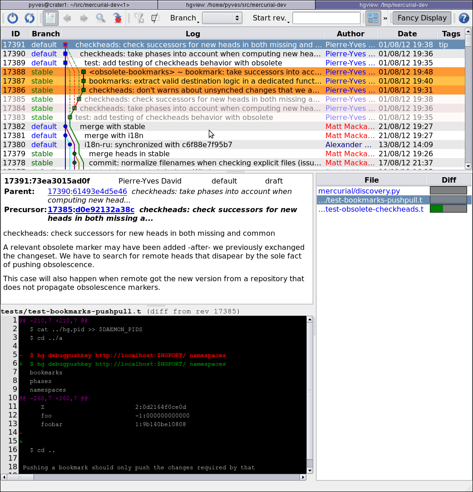

.. Copyright 2011 Pierre-Yves David <pierre-yves.david@ens-lyon.org>
..                Logilab SA        <contact@logilab.fr>

-------------
Evolve How To
-------------

Add a changeset: ``commit``
---------------------------

Just use commit as usual. New changesets will be in the `draft` phase.

Rewrite a changeset: ``commit --amend``
---------------------------------------

It writes a new changeset combining working-directory parent changes and parent.
It will work on any `draft` or `secret` changeset. It will not work on `public`
changesets.

To understand what the result of amend will be I use the two following
aliases   [#]_::

    # diff what amend will look like
    pdiff=diff --rev .^

    # status what amend will look like
    pstatus=status --rev .^

This command can even be invoked on changesets with children, provided
none are public.

.. [#] (defined by the evolve extension for you)

Move a changeset: ``grab``
--------------------------

You can use ``hg grab <rev>`` to move a rev at your current location, making the
old version obsolete.

.. note:: grab is an alias for ``hg rebase --dest . --rev $@; hg up <result>``

Delete a changeset: ``prune``
-----------------------------

A new ``prune`` command allows removing a changeset.

Just use ``hg prune <some-rev>``.

Moving within the history: ``gdown`` and ``gup``
------------------------------------------------

While working on mutable part of the history you often need to move between
mutable commits.

You just need to use standard update to work with evolve. For convenience, you
can use ``hg gup`` to move to the child commit or ``hg gdown`` to move to the parent commit.

Those command have ``previous`` and ``next`` alias.

.. note:: Those commands only exist for the convenience of getting qpush and qpop
          feeling back.

Collapse changesets: ``fold``
-----------------------------

You can use ``hg fold`` to collapse multiple changesets in a single one.

It takes two forms:

``hg fold <rev>`` folds everything from you current changeset to `<rev>`

``hg fold -r <revset>`` fold everything changeset matching the revset together.

Getting changes out of a commit
-------------------------------

The ``hg uncommit`` command lets you rewrite the parent commit without
selected changed files. Target files content is not altered and
appears again as "modified"::

  $ hg st
  M babar
  M celestine
  $ hg commit babar celestine
  $ hg st
  $ hg uncommit celestine
  $ hg status
  M celestine

Split a changeset
-----------------

To split on file boundaries, just use ``uncommit`` command.

If you need a fine-grained split, there is no official command for that yet.
However, it is easily achieved by manual operation::

  ### you want to split changeset A: 42
  # update to A parent
  $ hg up 42^
  # restore content from A
  $ hg revert -r 42 --all
  # partially commit the first part
  $ hg record
  # commit the second part
  $ hg commit
  # informs mercurial of what happened
  # current changeset (.) and previous one (.^) replace A (42)
  $ hg prune --new . --new .^ 42

For more complexe scenario we recommend the use of the histedit_ extension.

.. _histedit: https://www.mercurial-scm.org/wiki/HisteditExtension

Update my current work in progress after a pull
-----------------------------------------------

Whenever you are working on some changesets, it is more likely that a pull
will, eventually, import new changesets in your tree.

And it is likely that you will want your work in progress changesets to be
rebased on the top of this newly imported subtree.

Doing so is only a matter of rebasing.

Move multiple changesets: ``rebase``
------------------------------------

You can still use rebase to move a whole segment of the changeset graph together.

.. warning:: Beware that rebasing changesets already obsolete will likely result in
             divergent versions of the changesets.

Resolve history troubles: ``evolve``
------------------------------------

When you rewrite (amend) a changeset with children without rewriting
those children you create *unstable* changesets and *suspended
obsolete* changesets.

When you are finished amending a given changeset, you will want to
declare it stable, in other words rebase its former descendants on its
newest version.

You can also use evolve to solve `bumped` and `divergent` changeset/

Fix my history afterward: ``prune -n``
--------------------------------------

Sometimes you need to create an obsolete marker by hand. This may happen when
upstream has applied some of your patches for example.

you can use ``hg prune <old-changeset> --succ <new-changeset>`` to add obsolete
marker.

View diff from the last amend
-----------------------------

An ``odiff`` alias have been added by ``enable.sh``

::
    [alias]
    odiff = diff --rev 'limit(precursors(.),1)' --rev .

View obsolete markers
---------------------

hgview_ is the only viewer that currently supports this feature. You
need version 1.6.2

.. _hgview: http://www.logilab.org/project/hgview/

You can also use a debug command

    $ hg debugobsolete
      5eb72dbe0cb4 e8db4aa611f6
      c4cbebac3751 4f1c269eab68

Important Note
==============

View change to your file
------------------------

Extinct changesets are hidden using the *hidden* feature of mercurial.

Only ``hg log`` and ``hgview`` support it, other
graphical viewer do not.

You can use ``hg log --graph --hidden`` from the command line

