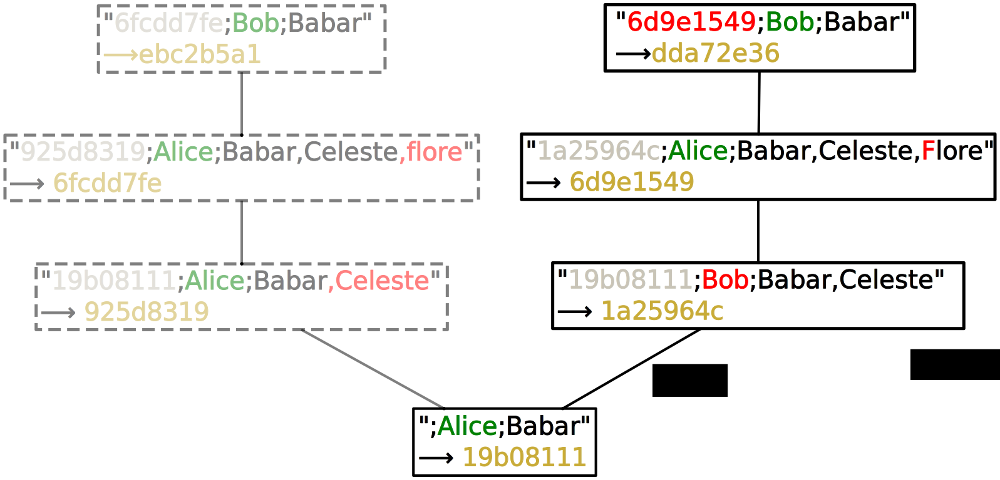

.. Copyright 2011 Pierre-Yves David <pierre-yves.david@ens-lyon.org>
..                Logilab SA        <contact@logilab.fr>

-----------------------------------
The instability Principle
-----------------------------------


An intrinsic contradiction
-----------------------------------

XXX starts by talking about getting ride of changeset.

DVCSes bring two new major concepts to the version control scene:

    * History is organized as a robust DAG,
    * History can be rewritten.

However, the two concepts are in contradiction:

To achieve a robust history, three key elements are gathered in *changesets*:

    * Full snapshot of the versioned content,
    * Reference to the previous full snapshot used to build the new one,
    * A description of the change which leads from the old content to the new content.

All three elements are used to compute a *unique* hash that identifies the changeset
(with various other metadata). This identification is a key part of DVCS design.

This is a very useful property because changing B's parent means
changing B's content too. This requires the creation of **another**
changeset, which is semantically good.




To avoid duplication, the older changeset is usually discarded from accessible
history. I'm calling them *obsolete* changesets.


But rewriting a changeset with children does not change the
children's parents! And because children of the rewritten changeset
still **depend** on the older "dead" version of the changeset, we
cannot get rid of this dead version.

::

  Schema base,  A and A' and B.

I'm calling these children **unstable** because they are based on a
dead changeset and prevent people from getting rid of it.

This instability is an **unavoidable consequence** of the strict dependency of
changesets.  Rewriting history always needs to take it into account and
provide a way to rewrite the descendants of the new changeset to avoid
coexistence of the old and new versions of a rewritten changeset.


Everybody is working around the issue
------------------------------------------------

I'm not claiming that rewriting history is impossible. People have been successfully
doing it for years. However they all need to work around *instability*. Several
workaround strategies exist.


Rewriting all at once
``````````````````````````

The simplest way to avoid instability is to ensure rewriting
operations always end in a stable situation. This is achieved by
rewriting all affected changesets at the same time.

Rewriting all descendants at the same time when rewriting a changeset.

::

  Schema!

Several Mercurial commands apply it: rebase, collapse, histedit.
Mercurial also refuses to amend changesets with descendants. The git
branch design enforces this approach in git too.


However, DVCS are **distributed**. This means that you do not control what
happens outside your repository. Once a changeset has been exchanged *outside*,
there is no way to be sure it does not have descendants somewhere else.
Therefore **if you rewrite changeset that exists elsewhere, you can't eradicate
the risk of instability.**

Do not rewrite exchanged changesets
```````````````````````````````````

To work around the issue above, Mercurial introduced phases, which
prevent you from rewriting shared changesets and ensure others can't
pull certain changesets from you. But this is a very frustrating
limitation that prevents you to efficiently sharing, reviewing and
collaborating on mutable changesets.

In the Git world, they use another approach to prevent instability. By
convention only a single developer works on a changeset contained in
a named branch. But once again this is a huge blocker for
collaborating. Moreover clueless people **will** mess up social
convention soon or later.


Lose the DAG robustness
````````````````````````````

The other approach in Mercurial is to keep the mutable part of the
history outside the DVCS constraint. This is the MQ approach of
sticking a quilt queue over Mercurial.

This allow much more flexible workflow but two major feature are lost in the
process:

:graceful merge: MQ uses plain patch to store changeset contents, which has
                 problems in changing context. Applying your queue
                 becomes very painful when context changes.

:easy branching: A quilt queue is by definition a linear queue, increasing risk
                 of conflict.

It is possible to collaborate over versioned MQ! But you are going to
have a lot of trouble.

Ignore conflicts
```````````````````````````````````
 
Another ignored issue is a conflicting rewrite of the same changeset.
If a changeset is rewritten two times we have two newer versions,
and duplicated history is complicated to merge.

Mercurial work around by

The "One set of mutable changset == One developer" mantra is also a way to work
around conflicting rewriting of changeset. If two different people are able to

The git branch model allows overwriting changeset version by another
one, but it does not care about divergent version. It is the equivalent
of "common ftp" source management for changesets.

Facing The Danger Once And For All
------------------------------------------------

Above we saw that the more effort you put to avoid instability, the more options
you deny. And even the most restrictive workflow can't guarantee that instability
will never show up!

Obsolete marker can handle the job
```````````````````````````````````

It is time to provide a full-featured solution to deal with
instability and to stop working around the issue! This is why I
am developing a new feature for Mercurial called "Obsolete markers".
Obsolete markers have two key properties:


* Any "old" changeset we want to get rid of is **explicitly** marked
  as "obsolete" by history rewriting operations.

  By explicitly marking the obsolete part of the history, we will be able to
  easily detect instability situation.

* Relations between old and new version of changesets are tracked by obsolete
  markers.

  By storing a meta-history of changeset evolution we are able to easily resolve
  instability and edit conflicts [#]_ .

.. [#] Edit conflicts is another major obstable to collaboration. See the
       section dedicated to obsolete marker for details.

Improved robustness == improved simplicity
````````````````````````````````````````````````

This proposal should **first** be seen as a safety measure.

It allows detecting instability as soon as possible.

::

    $ hg pull
    added 3 changeset
    +2 unstable changeset
    (do you want "hg evolve" ?)
    working directory parent is obsolete!
    $ hg push
    outgoing unstable changesets
    (use "hg evolve" or force the push)

And it should not not encourage people to create instability.

::

    $ hg up 42
    $ hg commit --amend
    changeset have descendant.
    $ hg commit --amend -f
    +5 unstable changeset

    $ hg rebase -D --rev 40::44
    rebasing already obsolete changeset 42:AAA will conflict with newer version 48:BBB

While allowing powerful feature
````````````````````````````````````````````````


* Help to automatically solve instability.

* "prune" changeset remotely.

* track resulting changeset when submitting patch//pull request.

* Focus on what you do:

  I do not like the "all at once" model of history rewriting. I'm comfortable
  with instability and obsolete marker offer all the tool to safely create and
  handle instability locally.


