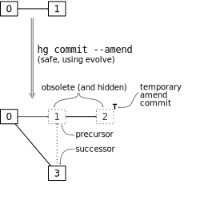
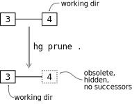
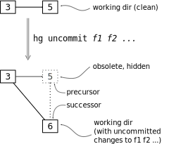
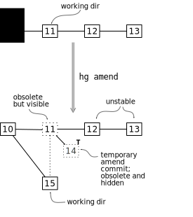
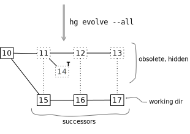
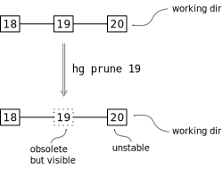
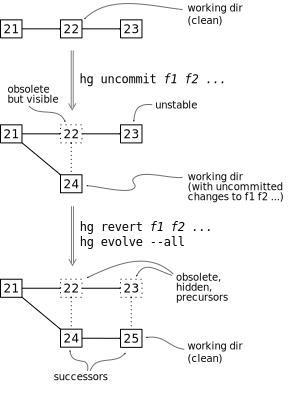
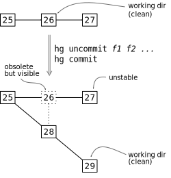
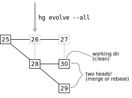

.. Copyright © 2014 Greg Ward <greg@gerg.ca>

------------------
Evolve: User Guide
------------------

.. contents::

Life without ``evolve``
-----------------------

Before we dive into learning about ``evolve``, let's look into some
features of core Mercurial that interact with ``evolve``. ``commit``
affects ``evolve``, and ``evolve`` modifies how ``commit --amend``
works.

Example 1: Commit a new changeset
=================================

To create a new changeset, simply run ``hg commit`` as usual.
``evolve`` does not change the behaviour of ``commit`` at all.

However, it's important to understand that new changesets are in the
*draft* phase by default: they are mutable. This means that they can
be modified by Mercurial's existing history-editing commands
(``rebase``, ``histedit``, etc.), and also by the ``evolve``
extension. Specifically, ``evolve`` adds a number of commands that can
be used to modify history: ``amend``, ``uncommit``, ``prune``,
``fold``, and ``evolve``. Generally speaking, changesets remain in
*draft* phase until they are pushed to another repository, at which
point they enter *public* phase. ::

  $ hg commit -m 'implement feature X'
  $ hg phase -r .
  1: draft

(Strictly speaking, changesets only become public when they are pushed
to a *publishing* repository. But all repositories are publishing by
default; you have to explicitly configure repositories to be
*non-publishing*. Non-publishing repositories are an advanced topic
which we'll see when we get to `sharing mutable history`_.)

.. _`sharing mutable history`: sharing.html

Example 2: Amend a changeset (traditional)
==========================================

Imagine you've just committed a new changeset, and then you discover a
mistake. Maybe you forgot to run the tests and a failure slipped in.
You want to modify history so that you push one perfect changeset,
rather than one flawed changeset followed by an "oops" commit. (Or
perhaps you made a typo in the commit message—this is really feature
*Y*, not feature X. You can't fix that with a followup commit.)

This is actually trivial with plain vanilla Mercurial since 2.2: fix
your mistake and run ::

  $ hg commit --amend -m 'implement feature Y'

to create a new, amended changeset. The drawback of doing this with
vanilla Mercurial is that your original, flawed, changeset is removed
from the repository. This is *unsafe* history editing. It's probably
not too serious if all you did was fix a syntax error, but still.

   Figure 1: unsafe history modification with core Mercurial (not
   using ``evolve``): the original revision 1 is destroyed.

(Incidentally, Mercurial's traditional history modification mechanism
isn't *really* unsafe: any changeset(s) removed from the repository
are kept in a backup directory, so you can manually restore them later
if you change your mind. But it's awkward and inconvenient compared to
the features provided by ``evolve`` and changeset obsolescence.)

Life with ``evolve`` (basic usage)
----------------------------------

Once you enable the ``evolve`` extension, a number of features are
available to you. First, we're going to explore several examples of
painless, trouble-free history modification.

Example 3: Amend a changeset (with ``evolve``)
==============================================

Outwardly, amending a changeset with ``evolve`` can look exactly the
same as it does with core Mercurial (example 2)::

  $ hg commit --amend -m 'implement feature Y'

Alternately, you can use the new ``amend`` command added by
``evolve``::

  $ hg amend -m 'implement feature Y'

(``hg amend`` is nearly synonymous with ``hg commit --amend``. The
difference is that ``hg amend`` reuses the existing commit message by
default, whereas ``hg commit --amend`` runs your editor if you don't
pass ``-m`` or ``-l``.)

Under the hood, though, things are quite different. Mercurial has
simply marked the old changeset *obsolete*, replacing it with a new
one. We'll explore what this means in detail later, after working
through a few more examples.

Example 4: Prune an unwanted changeset
======================================

Sometimes you make a change, and then decide it was such a bad idea
that you don't want anyone to know about it. Or maybe it was a
debugging hack that you needed to keep around for a while, but do not
intend to ever push publicly. ::

  $ echo 'debug hack' >> file1.c
  $ hg commit -m 'debug hack'

In either case, ``hg prune`` is the answer. ``prune`` simply marks
changesets obsolete without creating any new changesets to replace
them::

  $ hg prune .
  1 changesets pruned
  1 files updated, 0 files merged, 0 files removed, 0 files unresolved
  working directory now at 934359450037

Outwardly, it appears that your “debug hack” commit never happened;
we're right back where we started::

  $ hg parents --template '{rev}:{node|short}  {desc|firstline}\n'
  3:934359450037  implement feature Y

In reality, though, the “debug hack” is still there, obsolete and hidden.

Example 5: Uncommit changes to certain files
============================================

Occasionally you commit more than you intended: perhaps you made
unrelated changes to different files, and thus intend to commit
different files separately. ::

  $ echo 'relevant' >> file1.c
  $ echo 'irrelevant' >> file2.c

If you forget to specify filenames on the ``commit`` command line,
Mercurial commits all those changes together::

  $ hg commit -m 'fix bug 234'          # oops: too many files

Luckily, this mistake is easy to fix with ``uncommit``::

  $ hg uncommit file2.c
  $ hg status
  M file2.c

Let's verify that the replacement changeset looks right (i.e.,
modifies only ``file1.c``)::

  $ hg parents --template '{rev}:{node|short}  {desc|firstline}\n{files}\n'
  6:c8defeecf7a4  fix bug 234
  file1.c

As before, the original flawed changeset is still there, but obsolete
and hidden. It won't be exchanged with other repositories by ``push``,
``pull``, or ``clone``.

Example 6: Fold multiple changesets together into one
=====================================================

If you're making extensive changes to fragile source code, you might
commit more frequently than normal so that you can fallback on a
known good state if one step goes badly. ::

  $ echo step1 >> file1.c
  $ hg commit -m 'step 1'               # revision 7
  $ echo step2 >> file1.c
  $ hg commit -m 'step 2'               # revision 8
  $ echo step3 >> file2.c
  $ hg commit -m 'step 3'               # revision 9

At the end of such a sequence, you often end up with a series of small
changesets that are tedious to review individually. It might make more
sense to combine them into a single changeset using the ``fold``
command.

To make sure we pass the right revisions to ``fold``, let's review the
changesets we just created, from revision 7::

  $ hg log --template '{rev}:{node|short}  {desc|firstline}\n' -r 7::
  7:05e61aab8294  step 1
  8:be6d5bc8e4cc  step 2
  9:35f432d9f7c1  step 3

and fold them::

  $ hg fold -m 'fix bug 64' -r 7::
  3 changesets folded
  1 files updated, 0 files merged, 0 files removed, 0 files unresolved

This time, Mercurial marks three changesets obsolete, replacing them
all with a single *successor*.

(You might be familiar with this operation under other names, like
*squash* or *collapse*.)

Changeset obsolescence under the hood
-------------------------------------

So far, everything has gone just fine: we haven't run into merge
conflicts or other trouble. Before we start exploring advanced usage
that can run into trouble, let's step back and see what happens when
Mercurial marks changesets obsolete. That will make it much easier to
understand the more advanced use cases we'll see later.

When you have the ``evolve`` extension enabled, all history
modification uses the same underlying mechanism: the original
changesets are marked *obsolete* and replaced by zero or more
*successors*. The obsolete changesets are the *precursors* of their
successors. This applies equally to built-in commands (``commit
--amend``), commands added by ``evolve`` (``amend``, ``prune``,
``uncommit``, ``fold``), and commands provided by other extensions
(``rebase``, ``histedit``).

Another way of looking at it is that obsolescence is second-order
version control, i.e. the history of your history. We'll cover this in
more detail (and mathematical precision) in the `concepts`_ guide.

.. _`concepts`: concepts.html

Under the hood: Amend a changeset
=================================

Consider Example 2, amending a changeset with ``evolve``. We saw above
that you can do this using the exact same command-line syntax as core
Mercurial, namely ``hg commit --amend``. But the implementation is
quite different, and Figure 2 shows how.

   Figure 2: safe history modification using ``evolve``: the original
   revision 1 is preserved as an obsolete changeset. (The "temporary
   amend commit", marked with T, is an implementation detail stemming
   from limitations in Mercurial's current merge machinery. Future
   versions of Mercurial will not create them.)

In this case, the obsolete changesets are also *hidden*. That is the
usual end state for obsolete changesets. But many scenarios result in
obsolete changesets that are still visible, which indicates your
history modification work is not yet done. We'll see examples of that
later, when we cover advanced usage.

Understanding revision numbers and hidden changesets
====================================================

As the name implies, hidden changesets are normally not visible. If
you run ``hg log`` on the repository from Figure 2, Mercurial will
show revisions 0 and 3, but not 1 and 2. That's something you don't
see with plain vanilla Mercurial—normally, revision *N* is always
followed by revision *N* + 1.

This is just the visible manifestation of hidden changesets. If
revision 0 is followed by revision 3, that means there are two hidden
changesets, 1 and 2, in between.

To see those hidden changesets, use the ``--hidden`` option::

  $ hg --hidden log --graph --template '{rev}:{node|short}  {desc|firstline}\n'
  @  3:934359450037  implement feature Y
  |
  | x  2:6c5f78d5d467  temporary amend commit for fe0ecd3bd2a4
  | |
  | x  1:fe0ecd3bd2a4  implement feature Y
  |/
  o  0:08c4b6f4efc8  init

Note that changeset IDs are still the permanent, immutable identifier
for changesets. Revision numbers are, as ever, a handy shorthand that
work in your local repository, but cannot be used across repositories.
They also have the useful property of showing when there are hidden
changesets lurking under the covers, which is why this document uses
revision numbers.

Under the hood: Prune an unwanted changeset
===========================================

``prune`` (example 4 above) is the simplest history modification
command provided by ``evolve``. All it does is mark the specified
changeset(s) obsolete, with no successor/precursor relationships
involved. (If the working directory parent was one of the obsolete
changesets, ``prune`` updates back to a suitable ancestor.)

   Figure 3: pruning a changeset marks it obsolete with no successors.

Under the hood: Uncommit changes to certain files
=================================================

In one sense, ``uncommit`` is a simplified version of ``amend``. Like
``amend``, it obsoletes one changeset and leaves it with a single
successor. Unlike ``amend``, there is no ugly "temporary amend commit"
cluttering up the repository.

In another sense, ``uncommit`` is the inverse of ``amend``: ``amend``
takes any uncommitted changes in the working dir and “adds”
them to the working directory's parent changeset. (In reality, of
course, it creates a successor changeset, marking the original
obsolete.) In contrast, ``uncommit`` takes some changes in the working
directory's parent and moves them to the working dir, creating a new
successor changeset in the process. Figure 4 illustrates.

   Figure 4: uncommit moves some of the changes from the working
   directory parent into the working dir, preserving the remaining
   changes as a new successor changeset. (N.B. revision 4 is not shown
   here because it was marked obsolete in the previous example.)

Under the hood: Fold multiple changesets together into one
==========================================================

The last basic example is folding multiple changesets into one, which
marks multiple changesets obsolete, replacing them all with a single
successor.

.. figure:: figures/figure-ug05.svg

   Figure 5: fold combines multiple changesets into a single
   successor, marking the original (folded) changesets obsolete.

Obsolete is not hidden
======================

So far, every obsolete changeset we have seen is also hidden. However,
these are *not* the same thing—that's why they have different names.
It's entirely possible to have obsolete changesets that are not
hidden. We'll see examples of that soon, when we create *unstable*
changesets.

Note that all hidden changesets are obsolete: hidden is a subset of
obsolete.

Life with ``evolve`` (advanced usage)
-------------------------------------

Now that you've got a solid understanding of how ``evolve`` works in
concert with changeset obsolescence, let's explore some more advanced
scenarios. All of these scenarios will involve *unstable* changesets,
which is an unavoidable consequence of obsolescence. What really sets
``evolve`` apart from other history modification mechanisms is the
fact that it recognizes troubles like unstable changesets and provides
a consistent way for you to get out of trouble.

(Incidentally, there are two other types of trouble that changesets
can get into with ``evolve``: they may be *divergent* or *bumped*.
Both of those states are more likely to occur when `sharing mutable
history`_, so we won't see them in this user guide.)

.. _`sharing mutable history`: sharing.html

Example 7: Amend an older changeset
===================================

Sometimes you don't notice your mistakes until after you have
committed new changesets on top of them. ::

  $ hg commit -m 'fix bug 17'         # rev 11 (mistake here)
  $ hg commit -m 'cleanup'            # rev 12
  $ hg commit -m 'feature 23'         # rev 13

Traditionally, your only option is to commit an "oops" changeset that
fixes your mistake. That works, of course, but it makes you look bad:
you made a mistake, and the record of that mistake is recorded in
history for all eternity. (If the mistake was in the commit message,
too bad: you cannot fix it.)

More subtly, there now exist changesets that are *worse* than what
came before—the code no longer builds, the tests don't pass, or
similar. Anyone reviewing these patches will waste time on the error
in the earlier patch, and then the correction later on.

You can avoid all this by amending the bad changeset and *evolving*
subsequent history. Here's how it works, assuming you have just
committed revision 13 and noticed the mistake in revision 11::

  $ hg update 11
  [...fix mistake...]
  $ hg amend

At this point, revision 11 is *obsolete* and revisions 12 and 13—the
descendants of 11—are in a funny state: they are *unstable*.

   Figure 6: amending a changeset with descendants means the amended
   changeset is obsolete but remains visible; its non-obsolete
   descendants are *unstable*. The temporary amend commit, revision
   14, is hidden because it has no non-obsolete descendants.

All non-obsolete descendants of an obsolete changeset are unstable. An
interesting consequence of this is that revision 11 is still visible,
even though it is obsolete. Obsolete changesets with non-obsolete
descendants are not hidden.

The fix is to *evolve* history::

  $ hg evolve --all

This is a separate step, not automatically part of ``hg amend``,
because there might be conflicts. If your amended changeset modifies a
file that one of its descendants also modified, Mercurial has to fire
up your merge tool to resolve the conflict. More importantly, you have
to switch contexts from "writing code" to "resolving conflicts". That
can be an expensive context switch, so Mercurial lets you decide when
to do it.

The end state, after ``evolve`` finishes, is that the original
revisions (11-13) are obsolete and hidden. Their successor revisions
(15-17) replace them.

   Figure 7: evolve your repository (``hg evolve --all``) to take care
   of instability. Unstable changesets become obsolete, and are
   replaced by successors just like the amended changeset was.

Example 8: Prune an older changeset
===================================

Let's say you've just committed the following changesets::

  $ hg commit -m 'useful work'       # rev 18
  $ hg commit -m 'debug hack'        # rev 19
  $ hg commit -m 'more work'         # rev 20

You want to drop revision 19, but keep 18 and 20. No problem::

  $ hg prune 19
  1 changesets pruned
  1 new unstable changesets

As above, this leaves your repository in a funny intermediate state:
revision 20 is the non-obsolete descendant of obsolete revision 19.
That is, revision 20 is unstable.

   Figure 8: ``hg prune`` marks a changeset obsolete without creating
   a successor. Just like with ``hg amend``, non-obsolete descendants
   of the pruned changeset are now unstable.

As before, the solution to unstable changesets is to evolve your
repository::

  $ hg evolve --all

This rebases revision 20 on top of 18 as the new revision 21, leaving
19 and 20 obsolete and hidden:

.. figure:: figures/figure-ug09.svg

   Figure 9: once again, ``hg evolve --all`` takes care of instability.

Example 9: Uncommit files from an older changeset (discard changes)
=======================================================================

As in example 5, let's say you accidentally commit some unrelated
changes together. Unlike example 5, you don't notice your mistake
immediately, but commit a new changeset on top of the bad one. ::

  $ echo 'this fixes bug 53' >> file1.c
  $ echo 'debug hack' >> file2.c
  $ hg commit -m 'fix bug 53'                     # rev 22 (oops)
  $ echo 'and this handles bug 67' >> file1.c
  $ hg commit -m 'fix bug 67'                     # rev 23 (fine)

As with ``amend``, you need to travel back in time and repair revision
22, leaving your changes to ``file2.c`` back in the working
directory::

  $ hg update 22
  1 files updated, 0 files merged, 0 files removed, 0 files unresolved
  $ hg uncommit file2.c
  1 new unstable changesets
  $ hg status
  M file2.c

Now your repository has unstable changesets, so you need to evolve it.
But ``hg evolve`` requires a clean working directory to resolve merge
conflicts, so you need to decide what to do with ``file2.c``.

In this case, the change to ``file2.c`` was a temporary debugging
hack, so we can discard it and immediately evolve the instability away::

  $ hg revert file2.c
  $ hg evolve --all
  move:[23] fix bug 67
  atop:[24] fix bug 53

Figure 10 illustrates the whole process.

   Figure 10: ``hg uncommit`` of a changeset with descendants results
   in instability *and* a dirty working directory, both of which must
   be dealt with.

Example 10: Uncommit files to an older changeset (keep changes)
===================================================================

This is very similar to example 9. The difference that this time, our
change to ``file2.c`` is valuable enough to commit, making things a
bit more complicated. The setup is nearly identical::

  $ echo 'fix a bug' >> file1.c
  $ echo 'useful but unrelated' >> file2.c
  $ hg commit -u dan -d '11 0' -m 'fix a bug'     # rev 26 (oops)
  $ echo 'new feature' >> file1.c
  $ hg commit -u dan -d '12 0' -m 'new feature'   # rev 27 (fine)

As before, we update back to the flawed changeset (this time,
revision 26) and ``uncommit``, leaving uncommitted changes to
``file2.c`` in the working dir::

  $ hg update -q 26
  1 files updated, 0 files merged, 0 files removed, 0 files unresolved
  $ hg uncommit -q file2.c                        # obsoletes rev 26, creates rev 28
  1 new unstable changesets
  $ hg status
  M file2.c

This time, let's save that useful change before evolving::

  $ hg commit -m 'useful tweak'                   # rev 29

Figure 11 shows the story so far: ``uncommit`` obsoleted revision 26
and created revision 28, the successor of 26. Then we committed
revision 29, a child of 28. We still have to deal with the unstable
revision 27.

   Figure 11: Uncommitting a file and then committing that change
   separately will soon result in a two-headed repository.

This is where things get tricky. As usual when a repository has
unstable changesets, we want to evolve it::

  $ hg evolve --all

The problem is that ``hg evolve`` rebases revision 27 onto revision
28, creating 30 (the successor of 27). This is entirely logical: 27
was the child of 26, and 26's successor is 28. So of course 27's
successor (30) should be the child of 26's successor (28).
Unfortunately, that leaves us with a two-headed repository:

   Figure 12: ``evolve`` takes care of unstable changesets; it does
   not solve all the world's problems.

As usual when faced with a two-headed repository, you can either merge
or rebase. It's up to you.

Example 11: Recover an obsolete changeset
=========================================

Sometimes you might obsolete a changeset, and then change your mind. You'll
probably start looking for an “unobsolete” command to restore a changeset
to normal state. For complicated implementation reasons, that command
doesn't exist. (If you have already pushed an obsolescence marker to
another repo, then Mercurial would need a way to revoke that remote
obsolesence marker. That's a hard problem.)

Instead, ``evolve`` provides a ``touch`` command to resurrect an
obsolete changeset. An unexpected quirk: you almost certainly need to
use ``--hidden``, since obsolete changesets tend to be hidden, and you
can't reference a hidden changeset otherwise. Typical usage thus looks
like ::

  $ hg --hidden touch REV

This creates a new, normal changeset which is the same as ``REV``—except
with a different changeset ID. The new changeset will have the same parent
as ``REV``, and will be a successor of ``REV``.

The current implementation of ``hg touch`` is not ideal, and is likely to
change in the future. Consider the history in Figure 12, where revision 27
is obsolete and the child of 26, also obsolete. If we ``hg touch 27``, that
creates a new revision which is a non-obsolete child of 26—i.e., it is
unstable. It's also *divergent*, another type of trouble that we'll learn
about in the `next section`_.

.. _`next section`: sharing.html
